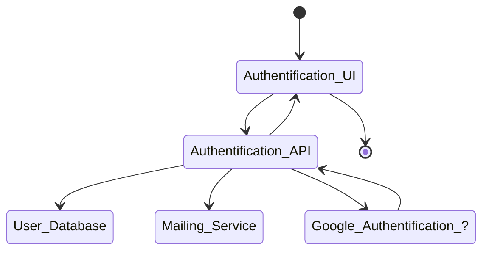

# Authentification POC

## Description

This is a Proof Of Concept for an authentification system.
This little project is a way for me to learn how to create a web application with a backend and a frontend with a authentification system.

## Features

- Nothing yet

### TODO

- [ ] Create the API
  - [ ] Create the database model
  - [ ] Create choose the API framework (REST, GraphQL, ...)
  - [ ] Create login endpoint
  - [ ] Create register endpoint
  - [ ] Create change password endpoint
  - [ ] Create reset password endpoint
  - [ ] Create forgot password endpoint
  
- [ ] Create the UI
  - [x] Choose the UI framework (~~React~~, ~~Angular~~, **Vue**, ...)
  - [ ] Create login page
  - [ ] Create private page
  - [ ] Create register page
  - [ ] Create change password page
  - [ ] Create reset password page
  - [ ] Create forgot password page
  - [ ] Create profile page
  - [ ] Create settings page
